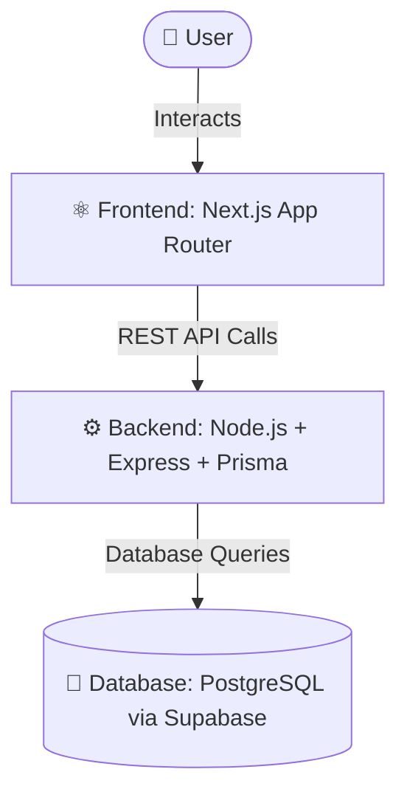

# 🏨 Hotel Booking Application

A modern full-stack hotel booking platform that enables users to browse rooms and make seamless bookings through an intuitive interface.

---

## 🚀 Overview

This project is built with a scalable and production-ready architecture:

- **Frontend:** Next.js (App Router)
- **Backend:** Node.js + Express
- **Database:** PostgreSQL (Supabase)
- **Deployment:** Vercel (Frontend), Railway (Backend)

---

## ✨ Key Features

- 🛏️ Browse available rooms
- 📄 View detailed room information
- 📅 Book rooms with real-time validation
- 📱 Fully responsive (mobile-first design)
- ⚡ Fast and optimized performance

---

## 🧠 Architecture

---

## 🛠 Tech Stack

| Layer      | Technology              |
|-----------|------------------------|
| Frontend  | Next.js, Tailwind CSS  |
| Backend   | Node.js, Express       |
| ORM       | Prisma                 |
| Database  | PostgreSQL (Supabase)  |
| Hosting   | Vercel + Railway       |

---

## 🔐 Production Improvements

- Persistent database (PostgreSQL via Supabase)
- Better scalability vs SQLite
- Cloud-managed infrastructure

---

## 🔮 Future Enhancements

- 🔐 Authentication & authorization
- 💳 Payment integration
- 📊 Analytics & monitoring
- ⚡ Caching (Redis)
- 🎨 Advanced UI/UX improvements

---

## 🌐 Live Project

Frontend: https://hotel-booking-roan-eight.vercel.app/

---

## 🧑‍💻 Author

Built by **Anurup Bansal**